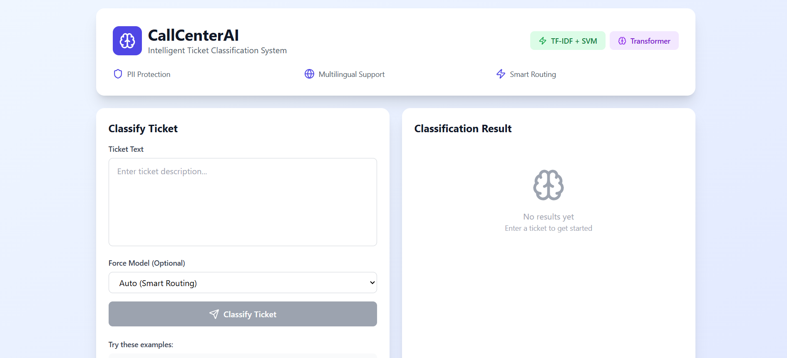
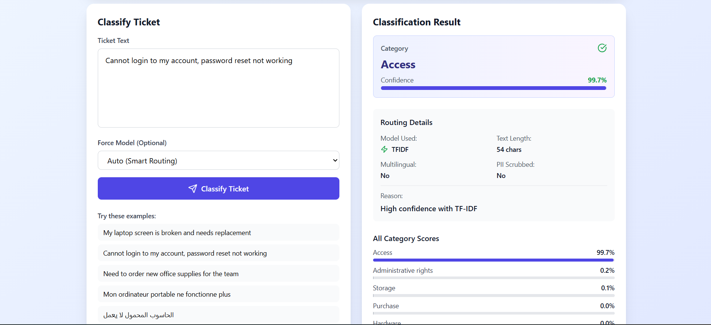
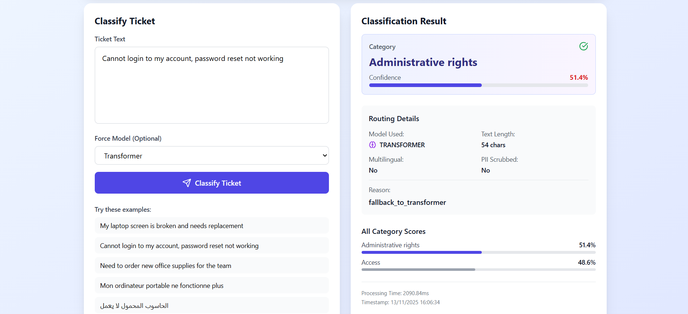
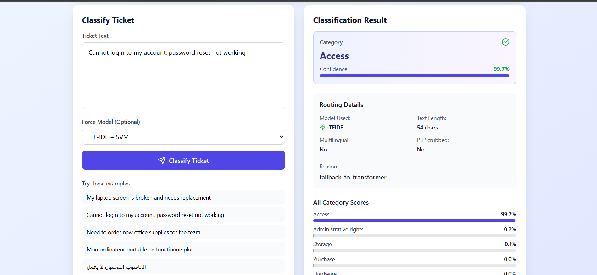

# CallCenterAI - Intelligent Ticket Classification System 🎯

[](https://github.com)
[](https://www.docker.com/)
[](https://www.python.org/)
[](https://fastapi.tiangolo.com/)

A complete MLOps solution for intelligent call center ticket classification using dual NLP approaches (TF-IDF + SVM and Transformer) with intelligent routing, monitoring, and visualization.

---

## 📋 Table of Contents

- [Overview](#overview)
- [Architecture](#architecture)
- [Features](#features)
- [Prerequisites](#prerequisites)
- [Screenshots](#screeshots)
- [Quick Start](#quick-start)
- [Project Structure](#project-structure)
- [API Documentation](#api-documentation)
- [Testing](#testing)
- [Monitoring & Observability](#monitoring--observability)
- [Model Performance](#model-performance)
- [Troubleshooting](#troubleshooting)
- [Contributing](#contributing)

---

## 🎯 Overview

CallCenterAI automatically classifies customer support tickets (emails, chat, phone) into business categories using:

- **TF-IDF + SVM**: Fast, efficient classification for simple queries
- **Transformer (DistilBERT)**: Advanced multilingual classification for complex tickets
- **Intelligent Agent**: Routes requests to the optimal model based on complexity, confidence, and language detection

### Supported Categories

- Hardware
- HR Support
- Access & Authentication
- Storage
- Purchase & Procurement
- Miscellaneous

---

## 🏗️ Architecture

```
┌─────────────┐
│   Frontend  │ (Port 3001)
│   (React)   │
└──────┬──────┘
       │
       ▼
┌─────────────────────────────────────────┐
│         Agent Service (Port 8000)       │
│  - PII Scrubbing                        │
│  - Intelligent Routing                  │
│  - Language Detection                   │
└─────┬───────────────────────┬───────────┘
      │                       │
      ▼                       ▼
┌─────────────┐      ┌──────────────────┐
│ TF-IDF Svc  │      │ Transformer Svc  │
│ (Port 8002) │      │   (Port 8001)    │
│ Fast & Light│      │ Multilingual GPU │
└─────────────┘      └──────────────────┘
      │                       │
      └───────────┬───────────┘
                  │
          ┌───────▼────────┐
          │  Prometheus    │ (Port 9090)
          │  (Metrics)     │
          └───────┬────────┘
                  │
          ┌───────▼────────┐
          │    Grafana     │ (Port 3000)
          │ (Visualization)│
          └────────────────┘
          
          ┌────────────────┐
          │    MLflow      │ (Port 5000)
          │ (Experiments)  │
          └────────────────┘
```

---

## ✨ Features

### Core Functionality
- ✅ **Dual Model Architecture**: TF-IDF + SVM for speed, Transformer for accuracy
- ✅ **Intelligent Routing**: Automatic model selection based on text complexity
- ✅ **PII Scrubbing**: Removes sensitive data (emails, phones, SSN, credit cards)
- ✅ **Multilingual Support**: Detects French, Arabic, Spanish, German
- ✅ **Confidence-Based Fallback**: Low-confidence TF-IDF predictions route to Transformer

### MLOps Features
- ✅ **Containerized**: Full Docker Compose deployment
- ✅ **Monitoring**: Prometheus + Grafana dashboards
- ✅ **Experiment Tracking**: MLflow integration
- ✅ **Health Checks**: Automated service health monitoring
- ✅ **Auto-Reload**: Development mode with live code updates

### Production Ready
- ✅ **REST APIs**: FastAPI with OpenAPI documentation
- ✅ **Metrics Export**: Prometheus-compatible endpoints
- ✅ **Error Handling**: Comprehensive error tracking
- ✅ **Logging**: Structured logging for debugging

---

## 📋 Prerequisites

### Required Software
- **Docker**: 20.10+ ([Install Docker](https://docs.docker.com/get-docker/))
- **Docker Compose**: 2.0+ ([Install Compose](https://docs.docker.com/compose/install/))
- **Git**: For cloning the repository
- **Python**: 3.13+ (for local development/training)

### Hardware Recommendations
- **CPU**: 4+ cores
- **RAM**: 8GB minimum (16GB recommended)
- **Disk**: 10GB free space
- **GPU**: Optional (for faster Transformer inference)

### Optional
- **Node.js**: 18+ (for frontend development)
- **CUDA**: 11.8+ (for GPU acceleration)

---

## 🖼️ Screenshots

<div align="center">

### Initial Grafana Dashboard State


### Agent (Auto) Result 


### Trasnformer Result


### TFIDF + SVM Result


</div>
---

## 📝 Future Enhancements

* Deep Learning integration (CNN, LSTM)
* Geo-location based threat intelligence
* Automated threat response (firewall rules)
* GPU acceleration for inference
* Integration with SIEM systems
* Distributed processing with Kafka
* Edge computing for sensors
* Zero-day and APT detection

---

## 🚀 Quick Start

### 1. Clone the Repository

```bash
git clone https://github.com/RayenMalouche/CallCenterAI-Molka-Rayen.git
cd CallCenterAI-Molka-Rayen
```

### 2. Prepare Models

Ensure you have trained models in the `models/` directory:

```
models/
├── tfidf/
│   ├── vectorizer.pkl
│   ├── model.pkl
│   ├── label_encoder.pkl
│   └── metadata.json
└── transformer/
    ├── final_model/
    │   ├── config.json
    │   ├── pytorch_model.bin
    │   └── tokenizer files...
    └── label_mapping.json
```

**Training Models** (if not already trained):

```bash
# Train TF-IDF model
python train_tfidf.py

# Train Transformer model (requires dataset)
python train_transformer.py
```

### 3. Launch All Services

```bash
docker-compose up -d --build
```

This will start:
- Agent Service (http://localhost:8000)
- Transformer Service (http://localhost:8001)
- TF-IDF Service (http://localhost:8002)
- Frontend (http://localhost:3001)
- Grafana (http://localhost:3000)
- Prometheus (http://localhost:9090)
- MLflow (http://localhost:5000)

### 4. Verify Deployment

```bash
# Check all services are running
docker-compose ps

# Check health endpoints
curl http://localhost:8000/health  # Agent
curl http://localhost:8001/health  # Transformer
curl http://localhost:8002/health  # TF-IDF
```

### 5. Access Services

| Service | URL | Credentials |
|---------|-----|-------------|
| **Frontend** | http://localhost:3001 | - |
| **Agent API** | http://localhost:8000/docs | - |
| **Grafana** | http://localhost:3000 | admin/admin |
| **Prometheus** | http://localhost:9090 | - |
| **MLflow** | http://localhost:5000 | - |

---

## 📁 Project Structure

```
callcenterai/
├── agent_service.py              # Intelligent routing agent
├── transformer_service.py        # Transformer API service
├── tfidf_service.py             # TF-IDF API service
├── train_tfidf.py               # TF-IDF training script
├── train_transformer.py         # Transformer training script
├── frontend/                    # React frontend application
│   ├── src/
│   │   ├── App.jsx
│   │   ├── components/
│   │   └── ...
│   ├── package.json
│   └── Dockerfile
├── models/                      # Trained models (not in git)
│   ├── tfidf/
│   └── transformer/
├── data/                        # Dataset (not in git)
│   └── all_tickets_cleaned.csv
├── grafana/                     # Grafana dashboards
│   └── provisioning/
│       ├── dashboards/
│       │   └── callcenterai.json
│       └── datasources/
│           └── prometheus.yml
├── docker-compose.yml           # Multi-container orchestration
├── Dockerfile.agent             # Agent service container
├── Dockerfile.transformer       # Transformer service container
├── Dockerfile.tfidf            # TF-IDF service container
├── Dockerfile.frontend         # Frontend container
├── prometheus.yml              # Prometheus configuration
├── requirements_agent.txt      # Agent dependencies
├── requirements_transformer.txt # Transformer dependencies
├── requirements_tfidf.txt      # TF-IDF dependencies
├── .gitignore                  # Git ignore patterns
├── .dockerignore               # Docker ignore patterns
└── README.md                   # This file
```

---

## 📚 API Documentation

### Agent Service (Port 8000)

#### POST `/predict`
Main endpoint for ticket classification with intelligent routing.

**Request:**
```json
{
  "text": "I cannot access my account, password reset not working",
  "force_model": null  // Optional: "tfidf" or "transformer"
}
```

**Response:**
```json
{
  "label": "Access",
  "confidence": 0.92,
  "all_scores": {
    "Access": 0.92,
    "Hardware": 0.03,
    "HR Support": 0.02,
    ...
  },
  "routing": {
    "chosen_model": "tfidf",
    "reason": "high_confidence_tfidf",
    "text_length": 56,
    "has_multilingual": false,
    "pii_scrubbed": false
  },
  "processing_time": 0.043,
  "timestamp": "2025-11-13T10:30:45.123456"
}
```

#### GET `/health`
Health check for agent and downstream services.

**Response:**
```json
{
  "status": "healthy",
  "tfidf_service": true,
  "transformer_service": true,
  "tfidf_url": "http://tfidf:8002",
  "transformer_url": "http://transformer:8001"
}
```

#### GET `/metrics`
Prometheus metrics endpoint.

**Metrics Exposed:**
- `agent_routing_total{model="tfidf|transformer"}` - Routing decisions
- `agent_routing_duration_seconds` - Request latency
- `agent_pii_scrubbed_total` - PII scrubbing operations
- `agent_errors_total{error_type="..."}` - Error counts
- `agent_downstream_services_health{service="..."}` - Service health

### TF-IDF Service (Port 8002)

#### POST `/predict`
Fast classification using TF-IDF + SVM.

**Request:**
```json
{
  "text": "Cannot login to my account"
}
```

**Response:**
```json
{
  "label": "Access",
  "confidence": 0.87,
  "all_probabilities": {...},
  "model": "tfidf-svm",
  "processing_time": 0.012,
  "timestamp": "2025-11-13T10:30:45.123456",
  "is_confident": true
}
```

### Transformer Service (Port 8001)

#### POST `/predict`
Advanced multilingual classification using DistilBERT.

**Request:**
```json
{
  "text": "Mon écran d'ordinateur est cassé"
}
```

**Response:**
```json
{
  "label": "Hardware",
  "confidence": 0.95,
  "all_scores": {...},
  "model": "transformer",
  "processing_time": 0.234,
  "timestamp": "2025-11-13T10:30:45.123456"
}
```

### Interactive API Documentation

- Agent: http://localhost:8000/docs
- TF-IDF: http://localhost:8002/docs
- Transformer: http://localhost:8001/docs

---

## 🧪 Testing

### Running All Tests

```bash
# Run full test suite
pytest tests/ -v --cov=. --cov-report=html

# Run specific test categories
pytest tests/test_agent.py -v        # Agent tests
pytest tests/test_tfidf.py -v        # TF-IDF tests
pytest tests/test_transformer.py -v  # Transformer tests
pytest tests/test_integration.py -v  # Integration tests
```

### Manual Testing with cURL

**Test Agent Service:**
```bash
curl -X POST "http://localhost:8000/predict" \
  -H "Content-Type: application/json" \
  -d '{"text": "My laptop screen is broken"}'
```

**Test TF-IDF Service:**
```bash
curl -X POST "http://localhost:8002/predict" \
  -H "Content-Type: application/json" \
  -d '{"text": "Cannot access my email"}'
```

**Test Transformer Service:**
```bash
curl -X POST "http://localhost:8001/predict" \
  -H "Content-Type: application/json" \
  -d '{"text": "Je ne peux pas me connecter à mon compte"}'
```

### Python Testing Script

```python
import requests

# Test agent
response = requests.post(
    "http://localhost:8000/predict",
    json={"text": "Password reset not working"}
)
print(response.json())
```

### Load Testing

```bash
# Install Apache Bench
apt-get install apache2-utils  # Linux
brew install ab                # macOS

# Run load test (100 requests, 10 concurrent)
ab -n 100 -c 10 -p request.json -T application/json \
   http://localhost:8000/predict
```

---

## 📊 Monitoring & Observability

### Grafana Dashboards

Access Grafana at http://localhost:3000 (admin/admin)

**Pre-configured Dashboard Includes:**
- Request rate per service (agent, tfidf, transformer)
- Average latency (p50, p95, p99)
- Error rates by type
- Model routing distribution
- PII scrubbing activity
- Service health status

**Setting Up Dashboards:**
1. Login to Grafana
2. Go to Dashboards → Import
3. The dashboard is auto-provisioned from `grafana/provisioning/dashboards/callcenterai.json`

### Prometheus Metrics

Access Prometheus at http://localhost:9090

**Useful Queries:**
```promql
# Request rate (requests per second)
rate(agent_routing_total[5m])

# Average latency
rate(agent_routing_duration_seconds_sum[5m]) / 
rate(agent_routing_duration_seconds_count[5m])

# Error rate
rate(agent_errors_total[5m])

# Model distribution
sum by(model) (agent_routing_total)
```

### MLflow Tracking

Access MLflow at http://localhost:5000

**Features:**
- Experiment tracking
- Model versioning
- Hyperparameter comparison
- Metric visualization

---

## 📈 Model Performance

### TF-IDF + SVM
- **Accuracy**: ~85-88%
- **Inference Time**: 10-20ms
- **Best For**: Short, English-only tickets
- **Model Size**: ~2MB

### Transformer (DistilBERT)
- **Accuracy**: ~92-95%
- **Inference Time**: 100-300ms (CPU), 20-50ms (GPU)
- **Best For**: Complex, multilingual tickets
- **Model Size**: 260MB

### Routing Strategy

| Condition | Model | Reason |
|-----------|-------|--------|
| Text < 50 chars | TF-IDF | Short & simple |
| Multilingual detected | Transformer | Language support |
| Text > 200 chars | Transformer | Complex content |
| TF-IDF confidence < 0.85 | Transformer | Low confidence fallback |
| Default | TF-IDF | Fast processing |

---

## 🐛 Troubleshooting

### Services Won't Start

**Issue**: Container fails to start
```bash
# Check logs
docker-compose logs -f <service-name>

# Common fixes
docker-compose down -v        # Remove volumes
docker-compose build --no-cache  # Rebuild images
docker-compose up -d
```

### Model Not Found

**Issue**: `Model not loaded` error
```bash
# Verify model files exist
ls -la models/tfidf/
ls -la models/transformer/final_model/

# Train models if missing
python train_tfidf.py
python train_transformer.py
```

### Port Conflicts

**Issue**: `Port already in use`
```bash
# Check what's using the port
lsof -i :8000  # Linux/macOS
netstat -ano | findstr :8000  # Windows

# Kill the process or change port in docker-compose.yml
```

### Out of Memory

**Issue**: Transformer service crashes
```bash
# Increase Docker memory limit (Docker Desktop → Settings → Resources)
# Minimum: 8GB RAM

# Or reduce batch size in transformer_service.py
```

### Grafana Dashboard Not Loading

```bash
# Restart Grafana
docker-compose restart grafana

# Check provisioning
docker exec callcenterai-grafana ls -la /etc/grafana/provisioning/dashboards/

# Manually import dashboard
# Grafana UI → Dashboards → Import → Upload JSON file
```

### Frontend Not Connecting to Backend

```bash
# Check CORS settings in agent_service.py
# Verify API URLs in frontend/.env

# Test API directly
curl http://localhost:8000/health
```

---

## 🔧 Configuration

### Environment Variables

**Agent Service:**
```bash
TFIDF_URL=http://tfidf:8002
TRANSFORMER_URL=http://transformer:8001
TFIDF_CONFIDENCE_THRESHOLD=0.85
SHORT_TEXT_THRESHOLD=50
LONG_TEXT_THRESHOLD=200
```

**Transformer Service:**
```bash
MODEL_PATH=/app/models/transformer/final_model
LABEL_MAPPING_PATH=/app/models/transformer/label_mapping.json
MAX_LENGTH=128
```

**TF-IDF Service:**
```bash
MODEL_PATH=/app/models/tfidf
CONFIDENCE_THRESHOLD=0.7
```

### Development Mode

Enable auto-reload for development:

```bash
# In docker-compose.yml, set for each service:
environment:
  - DEV_MODE=true
```

---

## 🤝 Contributing

### Development Setup

```bash
# Create virtual environment
python -m venv venv
source venv/bin/activate  # Linux/macOS
venv\Scripts\activate     # Windows

# Install dependencies
pip install -r requirements_agent.txt
pip install -r requirements_tfidf.txt
pip install -r requirements_transformer.txt

# Install dev dependencies
pip install pytest black flake8 isort pytest-cov
```

### Code Quality

```bash
# Format code
black *.py
isort *.py

# Lint
flake8 *.py

# Type checking
mypy *.py
```

### Testing Locally

```bash
# Run services locally (without Docker)
python tfidf_service.py &
python transformer_service.py &
python agent_service.py
```

---

## 📝 License

This project is licensed under the MIT License - see the [LICENSE](LICENSE) file for details.

---

## 👥 Authors

- **Mohamed Rayen Malouche** - [GitHub](https://github.com/RayenMalouche)
- **Mohamed Rayen Malouche** - [GitHub](https://github.com/MolkaToubale)

---

## 🙏 Acknowledgments

- ENSIT - École Nationale Supérieure d'Ingénieurs de Tunis
- Kaggle - IT Service Ticket Classification Dataset
- Hugging Face - Transformers library
- FastAPI, Prometheus, Grafana communities

---

## 📞 Support

For issues and questions:
- Open an issue on [GitHub Issues](https://github.com/RayenMalouche/CallCenterAI-Molka-Rayen/issues)
- Contact: rayenmalouche27@gmail.com

---

**Made with ❤️ for MLOps course 2025**